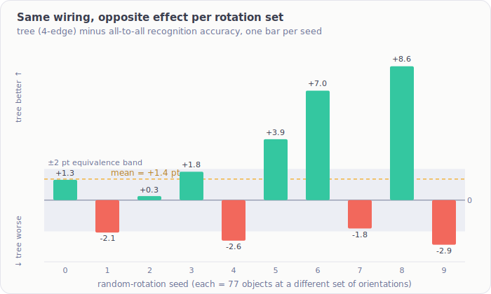

# Growing the architecture — first results (preliminary)

The [reproduction](reproduction.md) proved the model works. The actual research question is the one
in the [research plan](../theory/research-plan.md): can the cortical architecture be **grown / evolved**
rather than hand-designed — and does grown structure match or beat the hand-designed baseline? These
are the first experiments toward that. **They are preliminary, and the headline result is a
*negative/inconclusive* one — reported here in full because a pre-registered null is a result.**

Two phases:

- **E0 — evolve the *voting topology*** (which cortical columns share votes) on a **fixed** 5-column
  model. Cheap: a family of topologies can be evaluated on **one** trained model.
- **E1 — evolve the *column count and layout*** itself. Needs a fresh model per count; foundation now built.

---

## The engineering unlock behind E0

The voting topology — the graph of which of the 5 columns exchange votes to reach consensus — turns
out to be applied from the **evaluation configuration**, not baked into the trained model. So one
pretrained 5-column model can be re-tested under *any* voting topology with **no retraining**. That
turns "evaluate a population of topologies" from an expensive search into a nearly free one, and it is
what made E0 runnable on modest compute.

## E0 — the voting topology does not resolvably change accuracy on the shipped tasks

### 10-object task: a ceiling-saturated null
Across 18 topologies (edge counts 4→10, from a 4-edge tree up to the hand-designed all-to-all), every
one scored **99.4–100%**. But the all-to-all baseline *itself* wobbles 99.8–100% across random seeds,
so the whole spread is within the baseline's own noise. Conclusion: **the task is too easy** — accuracy
is saturated at the ceiling, leaving no headroom for topology to matter. The one honest positive: a
grown **4-edge tree matches the hand-designed 10-edge all-to-all** at ~equal convergence speed —
efficiency (60% fewer vote connections), not superiority.

### 77-object task: not saturated — but noise-limited
The harder 77-object benchmark is not at ceiling (~85–92%), so topology has room to separate. A first
sweep (one seed per topology) showed a ~6-point spread that *looked* like a real effect — until the
all-to-all baseline, run at three seeds, showed a **~4-point swing on its own** (same wiring, different
random rotations). The apparent spread was mostly seed noise. That motivated a properly-powered,
**pre-registered** re-run.

### 77-object paired close-out: INCONCLUSIVE
Five topologies × ten seeds = 50 evaluations, each topology compared to all-to-all on the **identical**
objects-and-rotations (paired), with the analysis, equivalence bounds (±2 accuracy points), and
decision rule all **registered before the data existed**.

| Topology | edges | mean accuracy | mean difference vs all-to-all | verdict |
|---|---|---|---|---|
| all-to-all (hand-designed) | 10 | 89.4% | — | reference |
| ring | 5 | 91.2% | +1.8 | inconclusive |
| path (tree) | 4 | 90.7% | +1.4 | inconclusive |
| "worst" 7-edge | 7 | 90.6% | +1.2 | inconclusive |
| star (hub) | 4 | 88.8% | −0.6 | inconclusive |

**Every arm landed *inconclusive*.** With 10 seeds we can claim **neither** that voting topology
matters **nor** that it doesn't — no difference is large enough to be significant, and none is tightly
enough bounded to declare equivalence. This is genuinely uninformative about the hypothesis (and, being
honest, *weaker* than a clean "topology is irrelevant" would have been — that would at least license
"use the cheapest topology"). Tempting-but-false readings we explicitly rejected: "sparse beats dense"
(the mean ordering is within noise, and `star` — also sparse — is the *worst* arm), and "ring looks
promising" (its apparent edge is the selection-inflated best-of-four; properly corrected it is not
significant).

### The one real, tool-grounded nuance: a zero-mean pose interaction

The per-seed differences don't just scatter randomly. For the **tree (path)** topology, the swing
across seeds (from −2.9 to +8.6 points) **exceeds the sampling-noise floor** — a genuine
*topology × object-pose interaction*: the sparse tree really does help on some sets of object
orientations and hurt on others. But it **averages to essentially zero**, so it does not make the tree
better or worse overall.

*Same wiring, opposite effect depending on the random rotation set. The bars swing ±several points; the
dashed line is their mean (+1.4). Most bars fall outside the ±2-point equivalence band even though their
average sits inside it — a real effect that is contingent on stimulus geometry and cancels in the mean.*

Concretely: the same `peach` is recognized by the tree at one orientation and missed at another; which
voting wiring wins depends on which columns happen to land on diagnostic surface features, and that
depends on the pose. The pose-ambiguous objects (round fruit, near-identical tools) are the ones that
flip.

## The methodology is the real win so far

In the spirit of [this project's first honest correction](reproduction.md#correction-2026-07-12-the-95-was-never-real),
the process here mattered more than the (inconclusive) number:

- **Pre-registration.** Hypotheses, statistical test, equivalence bounds, and the decision rule were
  committed *before* the run — so the inconclusive verdict couldn't be re-spun after seeing the data.
- **Adversarial review, three stages** (design → analysis → interpretation). One stage caught a
  **verdict-flipping statistical bug** in the analysis *before the data landed*: an early variance model
  ignored between-seed variability and would have manufactured a **false "topology doesn't matter."** A
  second stage caught the author over-reading the results (the "ring is promising" spin) after the fact.
- **Paired design.** Comparing topologies on identical stimuli removes the dominant nuisance variance
  (which objects/rotations were drawn), which is the only reason a signal as small as this is even
  discussable.

## E1 — evolving the column count (foundation built)

E0 held the column count fixed at 5. **E1 lets it vary** — the direction with the most headroom, since
the shipped 5-column tasks evidently don't give voting a load-bearing enough role to show an effect.
This needs a matching, internally-consistent set of configuration groups for an arbitrary number of
columns *N*, and a freshly trained model per *N*.

The **generator for those configurations is built and verified**: it produces a valid *N*-column
architecture for any *N*, and — the decisive check — regenerating the shipped 5-column configuration
reproduces it exactly. So minting a valid, arbitrary-column-count cortex is a solved, mechanical step;
what remains is training a model for a new *N* and running the grown-vs-designed comparison.

## New challenges this opens

1. **Find a task where voting is load-bearing.** Both shipped 5-column tasks fail to expose a
   resolvable topology effect — 10-object by saturation, 77-object by noise. Progress needs a regime
   where inter-column voting genuinely carries the recognition: more columns, more inter-object
   confusion, partial observability, or occlusion.
2. **Pose-conditional / adaptive voting.** The one real effect found is *pose-contingent and zero-mean*
   — no single fixed topology wins on average. That reframes the goal away from "find the best static
   wiring" toward voting that *adapts to context*, which is a far more interesting evolutionary target.
3. **Statistics at the edge of resolution.** Per-run variance on these tasks (few dozen objects, five
   correlated columns) is large relative to any plausible topology effect; resolving a few-point effect
   needs many seeds and winner's-curse-aware confirmatory replication, not a single sweep.
4. **Grown vs designed vs scaled.** With the *N*-column generator in place, the three-way comparison
   from the [research plan](../theory/research-plan.md) — does a *grown* (count, topology) beat the
   hand-designed 5-column model on accuracy-per-compute? — becomes directly runnable for the first time.

---

*Status: preliminary. No positive "grown beats designed" result yet — and this page will say so plainly
until there is one. What exists so far is a rigorous, pre-registered inconclusive result on voting
topology, a validated method for generating arbitrary-column-count architectures, and a sharpened set of
questions. Full experimental detail and the analysis live in the private implementation repository.*
